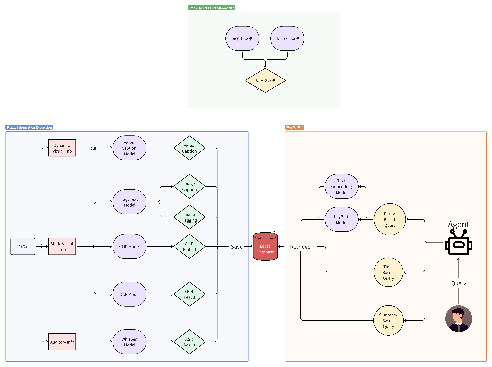
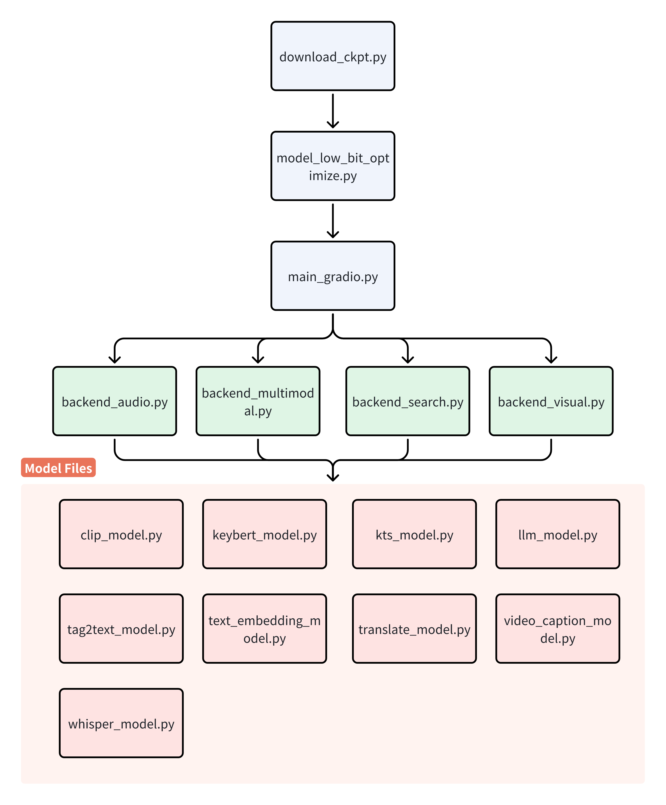

<p align="center" width="100%">
<!-- ALL-CONTRIBUTORS-BADGE:START - Do not remove or modify this section -->
[](#contributors-)
<!-- ALL-CONTRIBUTORS-BADGE:END -->
<a target="_blank"></a>
</p>

# 🐿️VideoPal: Pal for Long Video Chat Based on BigDL

Powered by **BigDL**, **ChatGLM3**, **CLIP**, **Whisper**, **Tag2Text**, **Paddleocr**, **multilingual-e5-large**, **LangChain**, **KeyBert**, **KTS**, **Helsinki** and inspired by **showlab/Vlog**, we decompose the video information into static visual information, dynamic visual information, and auditory information and store them in the database respectively, and use LangChain to build LLM Agent for retrieval and answer. Then we can chat over the record only using Intel CPU.

## Pipeline



## Demo

The video in the demo comes from the series 'Man vs. Wild' starring Bear Grylls. [Original Video](https://www.bilibili.com/video/BV1TB4y1G7UX/?buvid=Y542565C26C3A3144078A352B527EA23367E&from_spmid=search.search-result.0.0&is_story_h5=false&mid=PWRQlC05wkCWvFkgwpP%2B6A%3D%3D&p=1&plat_id=116&share_from=ugc&share_medium=iphone&share_plat=ios&share_session_id=5F677CC4-4160-4078-86E7-D600E9429A49&share_source=COPY&share_tag=s_i&spmid=united.player-video-detail.0.0&timestamp=1709556025&unique_k=GnQTba1&up_id=110915766&vd_source=3117d0d8eebdd770f05d775ac0bbd798)

|Origin Video Clip|Answer|
|:-:|:-:|
|||
|||

## Project Structure



## Environment Preparing
### System ---Windows/Linux
### 1. Create Conda Environment

```bash
conda create -n videopal python=3.9 -y
conda activate videopal
cd VideoPal
pip install -U -r requirements.txt
```

### 2. Install FFmpeg

#### System ---Windows

```bash
conda install -c conda-forge ffmpeg -y
```

#### System ---Linux

```bash
sudo apt update
sudo apt install ffmpeg
```
### 3. Install Mysql

```bash
sudo apt update
apt install mysql-server
sudo mysql_secure_installation
```

### 4. Configuration Your Database

#### Set Your Own Password

```bash
sudo mysql
# alter user 'root'@'localhost' identified with mysql_native_password by '123456';
alter user 'root'@'localhost' identified with mysql_native_password by [newpassword];
exit;
```
#### Create Your Own Database
```bash
mysql -u root -p
create database [your_database_name]
```

### 5. Download Model Weight

#### Download Models by Huggingface

```bash
python download_ckpt.py
```

#### Download Tag2Text weight from [here](https://huggingface.co/spaces/xinyu1205/recognize-anything/blob/main/tag2text_swin_14m.pth)

**✅Please save weights to ./checkpoints.**


### 6. Optimaize Models

```bash
python model_low_bit_optimize.py
```

### 7. Run with Gradio
```bash
python main_gradio.py --clip_low_bit --whisper_low_bit
```

## Tutorial
You can find the tutorial of 🐿️VideoPal [here](TUTORIAL.md).

## ❗Attention❗

#### 1. Gradio Warning

```bash
Could not create share link. Missing file: D:\anaconda3\envs\vchat\lib\site-packages\gradio\frpc_windows_amd64_v0.2.
```

Please check your internet connection. This can happen if your antivirus software blocks the download of this file. You can install manually by following these steps:

1. Download this file: https://cdn-media.huggingface.co/frpc-gradio-0.2/frpc_linux_amd64
2. Rename the downloaded file to: frpc_linux_amd64_v0.2
3. Move the file to this location: .\anaconda3\envs\vchat\lib\site-packages\gradio.
4. Give this file executable permissions (For Linux users)
```bash
chmod +x frpc_linux_amd64_v0.2
```

#### 2. One by One

Multiple people using the same demo at the same time will cause an error because the asynchronous running logic is not implemented.

#### 3. MySQL Error

If you encounter the following error:

```
Error: Can't connect to local MySQL server through socket '/var/run/mysqld/mysqld.sock' 
```

You can enter the following command on the command line to solve the problem：

```bash
mysqld&
```


## Acknowledge
We are grateful for the following awesome projects our VideoPal arising from:

-   [BigDL](https://github.com/intel-analytics/BigDL): Accelerate local LLM inference and finetuning on Intel CPU and GPU
-   [Tag2Text](https://tag2text.github.io/): An efficient and controllable vision-language model with tagging guidance
-   [Whisper](https://github.com/openai/whisper): Robust Speech Recognition via Large-Scale Weak Supervision
-   [ChatGLM3](https://github.com/THUDM/ChatGLM3): Open Bilingual Chat LLMs | 开源双语对话语言模型
-   [LangChain](https://python.langchain.com/en/latest/): A framework for developing applications powered by language models
-   [PaddleOCR](https://github.com/PaddlePaddle/PaddleOCR/tree/release/2.7): Awesome multilingual OCR toolkits based on PaddlePaddle
-   [SpaceTimeGPT](https://huggingface.co/Neleac/SpaceTimeGPT): A Spatiotemporal Video Captioning Model
-   [KeyBert](https://maartengr.github.io/KeyBERT/api/keybert.html): A minimal method for keyword extraction with BERT
-   [Vlog](https://github.com/showlab/VLog/tree/main): Transform Video as a Document with ChatGPT, CLIP, BLIP2, GRIT, Whisper, LangChain
-   [multilingual-e5-large](https://huggingface.co/intfloat/multilingual-e5-large): A multilingual text embedding
-   [KTS](https://inria.hal.science/hal-01022967/PDF/video_summarization.pdf): An algorithm for video summarization
-   [Helsinki](https://huggingface.co/Helsinki-NLP/opus-mt-zh-en): Open neural machine translation models

## 🤝 Contributors

<a href="https://github.com/Kailuo-Lai/VideoPal/graphs/contributors">
  
</a>

## Contributors ✨

Thanks goes to these wonderful people ([emoji key](https://allcontributors.org/docs/en/emoji-key)):

<!-- ALL-CONTRIBUTORS-LIST:START - Do not remove or modify this section -->
<!-- prettier-ignore-start -->
<!-- markdownlint-disable -->
<table>
  <tbody>
    <tr>
      <td align="center" valign="top" width="14.28%"><a href="https://github.com/Kailuo-Lai"><br /><sub><b>Kailuo</b></sub></a><br /><a href="https://github.com/Kailuo-Lai/Kailuo-Lai/VideoPal/commits?author=Kailuo-Lai" title="Code">💻</a></td>
    </tr>
  </tbody>
  <tfoot>
    <tr>
      <td align="center" size="13px" colspan="7">
        
          <a href="https://all-contributors.js.org/docs/en/bot/usage">Add your contributions</a>
        </img>
      </td>
    </tr>
  </tfoot>
</table>

<!-- markdownlint-restore -->
<!-- prettier-ignore-end -->

<!-- ALL-CONTRIBUTORS-LIST:END -->

This project follows the [all-contributors](https://github.com/all-contributors/all-contributors) specification. Contributions of any kind welcome!