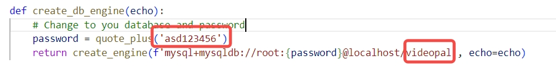
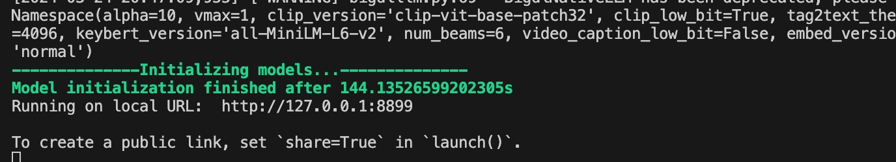
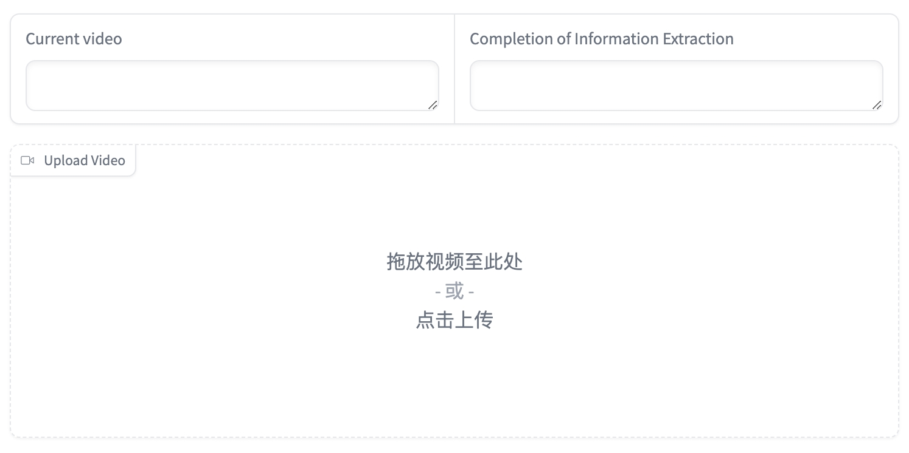
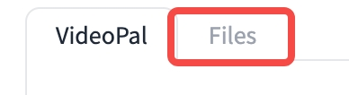
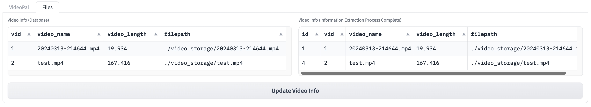
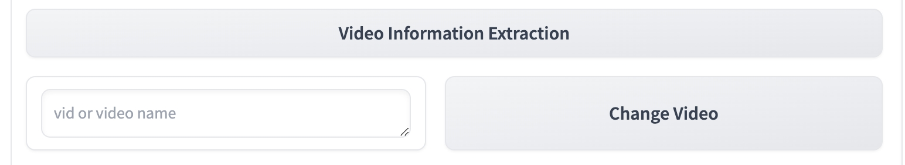
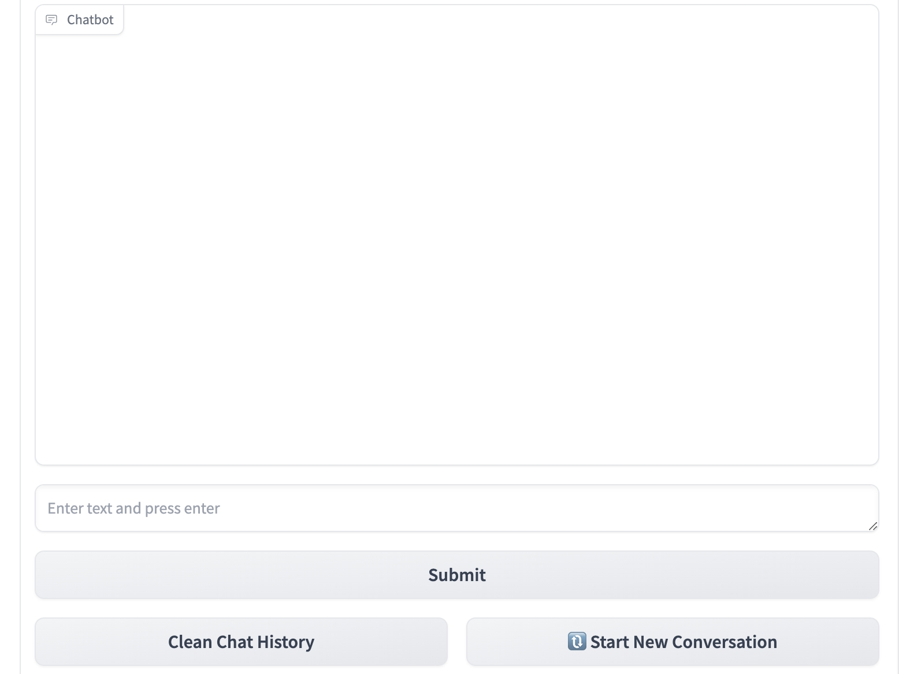

# How to Use 🐿️VideoPal
## STEP1 Please replace the database name and password in the 'utils.database.py' file with your own name and password

## STEP2 Open the Given URL in Local Browser

## STEP3 Load Demo Video or Upload Video

## STEP4 View Video in DataBase

- Switch to **Files** Tab

- **Left**: Video in database, **Right**: Video which has finished information extraction process

## STEP5 Extract Information from Video

-   Change to video which has not been processed

-   Click **Video Information Extraction** Button

-   Wait for a while

## STEP6 Chat with Video

